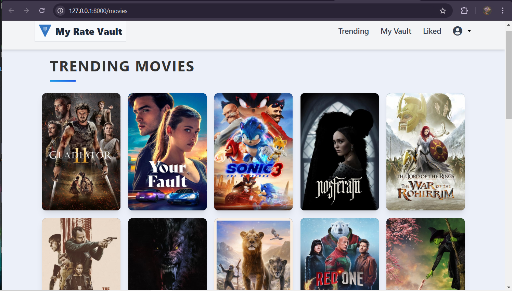
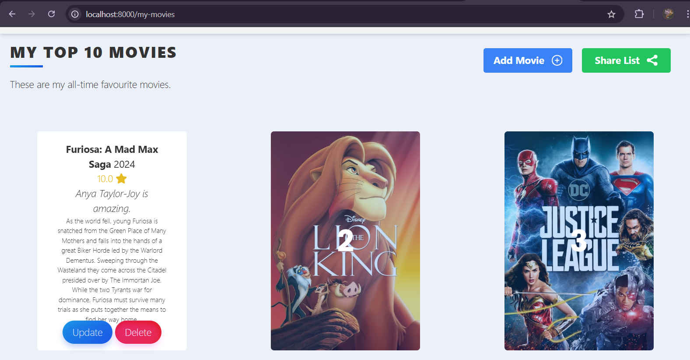
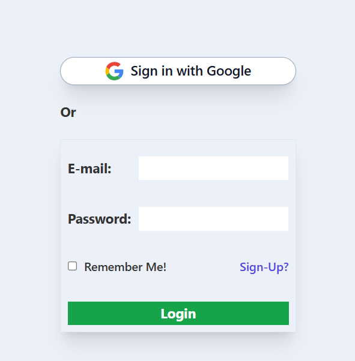
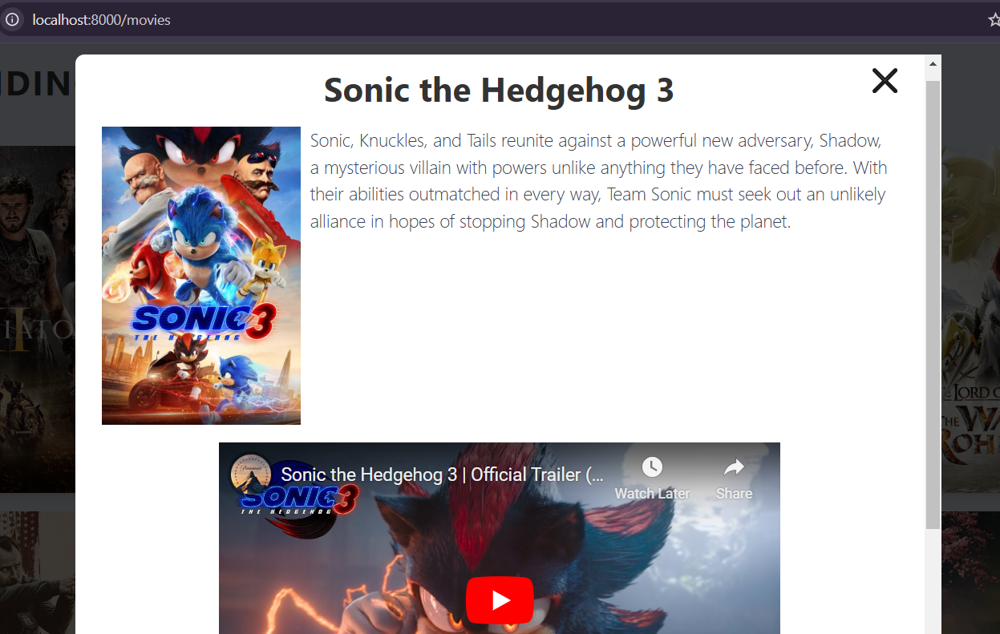

# MyRateVault

MyRateVault is a dynamic movie and TV show application built with Laravel and Alpine.js for interactivity. It provides users with a seamless way to explore the latest trending movies and TV shows, fetch trailers via the YouTube API, create and share lists of their favorite titles, and rate their watched content. It also supports Google Authentication for user login and registration.

---

## Features
- **Trending Movies and TV Shows**: Discover the latest trending titles from a robust external API.
- **Favorite Lists**: Users can create, manage, and share their favorite movie lists.
- **Ratings and Reviews**: Rate and review movies and TV shows.
- **Interactive UI**: Powered by Alpine.js for smooth interactivity.

---

## Screenshot


****
****
****
****

Visual overview of MyRateVault.

---

## Installation and Setup

Follow these steps to run MyRateVault locally:

### Prerequisites
- PHP 8.1 or higher
- Composer
- Node.js & npm
- MySQL database
- Git

### Steps

1. **Clone the Repository**
   ```bash
   git clone https://github.com/NjauSamuel/MyRateVault.git
   cd myratevault
   ```

2. **Install Dependencies**
   - Backend dependencies:
     ```bash
     composer install
     ```
   - Frontend dependencies:
     ```bash
     npm install
     ```

3. **Environment Setup**
   Copy the `.env.example` file to create a `.env` file and configure your database credentials and API keys.
   ```bash
   cp .env.example .env
   ```
   Update the following lines in the `.env` file:
   ```env
   DB_DATABASE=your_database_name
   DB_USERNAME=your_database_user
   DB_PASSWORD=your_database_password
   MOVIE_API_KEY=your_api_key_here
   ```

4. **Generate Application Key**
   ```bash
   php artisan key:generate
   ```

5. **Run Migrations and Seeders**
   ```bash
   php artisan migrate --seed
   ```

6. **Build Frontend Assets**
   ```bash
   npm run dev
   ```

7. **Start the Development Server**
   ```bash
   php artisan serve
   ```
   Access the application at `http://localhost:8000`.

---

## Usage
- Browse trending movies and TV shows fetched from an external API.
- Create personalized favorite movie lists and share them with friends.
- Rate and review movies to keep track of your preferences.

---

## Contributing
Contributions are welcome! Please fork the repository and submit a pull request with your improvements. 

**Author:** [Samuel Njau](https://www.linkedin.com/in/samuel-njau/)

---

## License

The Laravel framework is open-sourced software licensed under the [MIT license](https://opensource.org/licenses/MIT).
